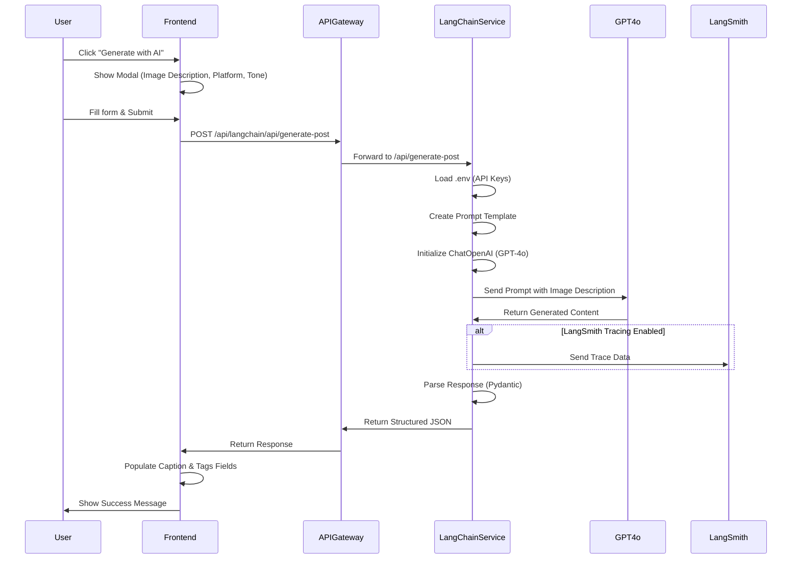

# LangChain Social Media Post Service

A Python microservice that uses LangChain and GPT-4o to generate structured social media posts from image descriptions.

## Architecture Overview

```
┌─────────────────────────────────────────────────────────────────┐
│                        Microservices Architecture                │
└─────────────────────────────────────────────────────────────────┘

    ┌──────────────┐
    │   Frontend   │  (React App)
    │  Port: 3000  │
    └──────┬───────┘
           │ HTTP Request
           │ POST /api/langchain/api/generate-post
           ▼
    ┌──────────────┐
    │ API Gateway  │  (Node.js/Express)
    │  Port: 8000  │
    └──────┬───────┘
           │ Forward Request
           │ POST /api/generate-post
           ▼
    ┌──────────────────────┐
    │ LangChain Service    │  (Python/FastAPI)
    │     Port: 5006       │
    └──────┬───────────────┘
           │
           │ LangChain + OpenAI API
           ▼
    ┌──────────────┐
    │   GPT-4o     │  (OpenAI)
    │   (Cloud)    │
    └──────────────┘
           │
           │ Generated Content
           ▼
    ┌──────────────────────┐
    │  Structured Response │
    │  - Caption           │
    │  - Call to Action    │
    │  - Tags              │
    └──────────────────────┘
```

## Request Flow Diagram



## Service Integration

```
┌─────────────────────────────────────────────────────────────┐
│                    Frontend Integration                      │
└─────────────────────────────────────────────────────────────┘

  StoryForm Component
  ┌─────────────────────────────────────┐
  │  Caption Input Field                │
  │  ┌───────────────────────────────┐   │
  │  │ [Text Area]                  │   │
  │  └───────────────────────────────┘   │
  │  ✨ Generate with AI Button          │
  │                                      │
  │  Tags Input Field                    │
  │  ┌───────────────────────────────┐   │
  │  │ [Text Area]                  │   │
  │  └───────────────────────────────┘   │
  └─────────────────────────────────────┘
           │
           │ User clicks "Generate with AI"
           ▼
  ┌─────────────────────────────────────┐
  │  AI Generation Modal                 │
  │  ┌───────────────────────────────┐   │
  │  │ Image Description: [input]    │   │
  │  │ Platform: [dropdown]          │   │
  │  │ Tone: [dropdown]              │   │
  │  │ [Generate Caption Button]     │   │
  │  └───────────────────────────────┘   │
  └─────────────────────────────────────┘
           │
           │ API Call
           ▼
  ┌─────────────────────────────────────┐
  │  LangChain Service                  │
  │  Returns: {                          │
  │    caption: "...",                   │
  │    call_to_action: "...",            │
  │    tags: ["#tag1", "#tag2"]          │
  │  }                                   │
  └─────────────────────────────────────┘
           │
           │ Auto-populate fields
           ▼
  ┌─────────────────────────────────────┐
  │  Caption & Tags Fields Filled       │
  └─────────────────────────────────────┘
```

## Features

- **Structured Output**: Generates posts with caption and optional call-to-action
- **Platform Support**: Supports Instagram, Twitter, Facebook, and LinkedIn
- **Customizable Tone**: Adjustable tone (friendly, professional, casual, enthusiastic)
- **RESTful API**: FastAPI-based service with OpenAPI documentation
- **Docker Ready**: Fully containerized and ready for deployment

## API Endpoints

### Health Check

```
GET /health
```

Returns service health status.

### Generate Post

```
POST /api/generate-post
```

**Request Body:**

```json
{
  "image_description": "A beautiful sunset over the mountains with vibrant orange and pink colors",
  "platform": "instagram",
  "tone": "friendly"
}
```

**Response:**

```json
{
  "success": true,
  "post": {
    "caption": "There's nothing quite like watching the sun paint the sky in shades of orange and pink. Nature's daily masterpiece never fails to amaze! 🌅",
    "call_to_action": "What's your favorite sunset spot? Share in the comments! 👇",
    "tags": [
      "#SunsetLovers",
      "#MountainViews",
      "#NaturePhotography",
      "#EveningGlow"
    ]
  },
  "platform": "instagram",
  "tone": "friendly"
}
```

## Environment Variables

The service uses a `.env` file for configuration. Create a `.env` file in the `services/langchain-service/` directory with the following variables:

- `OPENAI_API_KEY`: Your OpenAI API key (required)
- `LANGSMITH_TRACING`: Enable LangSmith tracing (true/false, default: false)
- `LANGSMITH_API_KEY`: Your LangSmith API key (required if tracing is enabled)
- `LANGSMITH_PROJECT`: LangSmith project name (default: "langchain-service")
- `PORT`: Service port (default: 5006)

See `env.template` for a template file.

## Running with Docker

### Using Docker Compose

1. Create a `.env` file in `services/langchain-service/` directory:

```bash
cd services/langchain-service
cp env.template .env
# Edit .env with your API keys
```

2. Start the service:

```bash
docker-compose -f docker-compose.microservices.yml up langchain-service
```

The docker-compose file is configured to automatically load the `.env` file from the service directory.

### Building and Running Standalone

1. Build the Docker image:

```bash
docker build -f services/langchain-service/Dockerfile -t langchain-service .
```

2. Run the container (with .env file):

```bash
docker run -p 5006:5006 --env-file services/langchain-service/.env langchain-service
```

Or with individual environment variables:

```bash
docker run -p 5006:5006 \
  -e OPENAI_API_KEY=your-api-key-here \
  -e LANGSMITH_TRACING=true \
  -e LANGSMITH_API_KEY=your-langsmith-key \
  -e LANGSMITH_PROJECT=search-agent \
  langchain-service
```

## Running Locally (Development)

1. Install dependencies:

```bash
cd services/langchain-service
pip install -r requirements.txt
```

2. Create a `.env` file in the service directory:

```bash
cd services/langchain-service
cp env.template .env
# Edit .env with your API keys
```

Or set environment variables:

```bash
export OPENAI_API_KEY=your-api-key-here
export LANGSMITH_TRACING=true
export LANGSMITH_API_KEY=your-langsmith-key
export LANGSMITH_PROJECT=search-agent
export PORT=5006
```

3. Run the service:

```bash
python src/main.py
```

Or using uvicorn directly:

```bash
uvicorn src.main:app --host 0.0.0.0 --port 5006 --reload
```

## Testing the API

### Using curl:

```bash
curl -X POST "http://localhost:5006/api/generate-post" \
  -H "Content-Type: application/json" \
  -d '{
    "image_description": "A cozy coffee shop with vintage decor and plants",
    "platform": "instagram",
    "tone": "friendly"
  }'
```

### Using Python:

```python
import requests

response = requests.post(
    "http://localhost:5006/api/generate-post",
    json={
        "image_description": "A cozy coffee shop with vintage decor and plants",
        "platform": "instagram",
        "tone": "friendly"
    }
)

print(response.json())
```

## API Documentation

Once the service is running, visit:

- Swagger UI: `http://localhost:5006/docs`
- ReDoc: `http://localhost:5006/redoc`

## Request Parameters

- `image_description` (required): Description of the image (10-1000 characters)
- `platform` (optional): Target platform - `instagram`, `twitter`, `facebook`, `linkedin` (default: `instagram`)
- `tone` (optional): Post tone - `friendly`, `professional`, `casual`, `enthusiastic` (default: `friendly`)

## Response Structure

- `success`: Boolean indicating if the request was successful
- `post`: Structured post object containing:
  - `caption`: Main caption text (2-3 sentences)
  - `call_to_action`: Optional call to action
  - `tags`: Array of relevant hashtags (5-10 items)
- `platform`: The platform used for generation
- `tone`: The tone used for generation

## LangSmith Tracing

The service supports LangSmith tracing for monitoring and debugging LangChain operations. To enable:

1. Set `LANGSMITH_TRACING=true` in your `.env` file
2. Provide your `LANGSMITH_API_KEY`
3. Optionally set `LANGSMITH_PROJECT` to organize traces in LangSmith

When enabled, all LangChain operations will be traced and visible in your LangSmith dashboard.

### Tracing Flow

```
┌─────────────────────────────────────────────────────────────┐
│              LangSmith Tracing Architecture                  │
└─────────────────────────────────────────────────────────────┘

  LangChain Service
  ┌──────────────────────┐
  │  ChatOpenAI          │
  │  (GPT-4o)            │
  └──────────┬───────────┘
             │
             │ If LANGSMITH_TRACING=true
             ▼
  ┌──────────────────────┐
  │  LangSmith Client    │
  │  - Traces LLM calls  │
  │  - Logs prompts      │
  │  - Tracks tokens     │
  └──────────┬───────────┘
             │
             │ HTTP POST
             ▼
  ┌──────────────────────┐
  │  LangSmith API       │
  │  api.smith.langchain │
  │  .com                │
  └──────────┬───────────┘
             │
             │ Store traces
             ▼
  ┌──────────────────────┐
  │  LangSmith Dashboard │
  │  - View traces       │
  │  - Debug issues      │
  │  - Monitor usage     │
  └──────────────────────┘
```

## Data Flow Example

```
┌─────────────────────────────────────────────────────────────┐
│                    Complete Request Flow                     │
└─────────────────────────────────────────────────────────────┘

1. User Input:
   ┌─────────────────────────────────────┐
   │ Image: "Sunset over mountains"      │
   │ Platform: Instagram                 │
   │ Tone: Friendly                      │
   └─────────────────────────────────────┘
                    │
                    ▼
2. LangChain Processing:
   ┌─────────────────────────────────────┐
   │ Prompt Template:                    │
   │ "Create a social media post for:    │
   │  Image: Sunset over mountains       │
   │  Platform: Instagram                │
   │  Tone: Friendly"                    │
   └─────────────────────────────────────┘
                    │
                    ▼
3. GPT-4o Generation:
   ┌─────────────────────────────────────┐
   │ LLM generates structured content    │
   │ using Pydantic schema               │
   └─────────────────────────────────────┘
                    │
                    ▼
4. Parsed Response:
   ┌─────────────────────────────────────┐
   │ {                                   │
   │   "caption": "Nature's masterpiece  │
   │    at its finest! 🌄...",           │
   │   "call_to_action": "Share your...",│
   │   "tags": ["#SunsetLovers", ...]    │
   │ }                                   │
   └─────────────────────────────────────┘
                    │
                    ▼
5. Frontend Display:
   ┌─────────────────────────────────────┐
   │ Caption Field:                      │
   │ "Nature's masterpiece...             │
   │  Share your..."                     │
   │                                      │
   │ Tags Field:                         │
   │ "#SunsetLovers, #MountainViews..."  │
   └─────────────────────────────────────┘
```

## Technology Stack

```
┌─────────────────────────────────────────────────────────────┐
│                    Technology Stack                          │
└─────────────────────────────────────────────────────────────┘

  Application Layer
  ┌──────────────────────┐
  │   FastAPI             │  (Python Web Framework)
  │   - REST API          │
  │   - OpenAPI Docs      │
  │   - Pydantic Models   │
  └──────────────────────┘
           │
           ▼
  AI/ML Layer
  ┌──────────────────────┐
  │   LangChain          │  (LLM Framework)
  │   - ChatOpenAI       │
  │   - Prompt Templates │
  │   - Output Parsers   │
  └──────────────────────┘
           │
           ▼
  LLM Provider
  ┌──────────────────────┐
  │   OpenAI GPT-4o      │  (Large Language Model)
  │   - Text Generation  │
  │   - Structured Output│
  └──────────────────────┘
           │
           ▼
  Observability
  ┌──────────────────────┐
  │   LangSmith          │  (Optional Tracing)
  │   - Trace Monitoring │
  │   - Debug Tools      │
  └──────────────────────┘
```

## What is Pydantic Used For?

Pydantic is a Python library for data validation using Python type annotations. In this service, Pydantic serves three critical roles:

### 1. **Request/Response Validation**

Pydantic models validate incoming API requests and ensure responses match the expected structure:

```python
class PostRequest(BaseModel):
    image_description: str = Field(..., min_length=10, max_length=1000)
    platform: Optional[str] = Field(default="instagram")
    tone: Optional[str] = Field(default="friendly")
```

**Benefits:**

- ✅ Automatic validation of input data
- ✅ Type safety and error messages
- ✅ Automatic OpenAPI schema generation for API docs

### 2. **Structured LLM Output Parsing**

Pydantic is used with LangChain's `PydanticOutputParser` to ensure the LLM returns structured, validated data:

```python
class SocialMediaPost(BaseModel):
    caption: str
    call_to_action: Optional[str]
    tags: Optional[list[str]]

output_parser = PydanticOutputParser(pydantic_object=SocialMediaPost)
```

**How it works:**

```
┌─────────────────────────────────────────────────────────────┐
│           Pydantic Output Parsing Flow                      │
└─────────────────────────────────────────────────────────────┘

1. LLM Response (Raw Text):
   ┌─────────────────────────────────────┐
   │ "Here's a caption: Nature's...      │
   │  Call to action: Share your...      │
   │  Tags: #SunsetLovers, #Mountains"   │
   └─────────────────────────────────────┘
                    │
                    ▼
2. PydanticOutputParser:
   ┌─────────────────────────────────────┐
   │ Extracts structured data from text   │
   │ Validates against Pydantic schema    │
   │ Handles format errors gracefully    │
   └─────────────────────────────────────┘
                    │
                    ▼
3. Validated Pydantic Object:
   ┌─────────────────────────────────────┐
   │ SocialMediaPost(                    │
   │   caption="Nature's...",            │
   │   call_to_action="Share your...",   │
   │   tags=["#SunsetLovers", ...]        │
   │ )                                    │
   └─────────────────────────────────────┘
                    │
                    ▼
4. JSON Response:
   ┌─────────────────────────────────────┐
   │ {                                   │
   │   "caption": "Nature's...",          │
   │   "call_to_action": "Share...",      │
   │   "tags": ["#SunsetLovers", ...]    │
   │ }                                   │
   └─────────────────────────────────────┘
```

**Benefits:**

- ✅ Guarantees structured output from LLM
- ✅ Automatic validation of LLM responses
- ✅ Type-safe data handling
- ✅ Clear error messages if LLM output doesn't match schema

### 3. **Data Type Safety**

Pydantic ensures type safety throughout the application:

```python
# Request validation
request: PostRequest  # Validated on API entry

# Response validation
response: PostResponse  # Validated before sending

# LLM output validation
post: SocialMediaPost  # Validated after parsing
```

**Example Validation:**

```python
# ✅ Valid request
PostRequest(
    image_description="A beautiful sunset",
    platform="instagram",
    tone="friendly"
)

# ❌ Invalid request - automatically rejected
PostRequest(
    image_description="short",  # Too short (< 10 chars)
    platform="invalid_platform"  # Not in allowed list
)
# Returns: ValidationError with clear error messages
```

### Why Pydantic is Essential Here

1. **LLM Output Reliability**: LLMs can return inconsistent formats. Pydantic ensures we always get valid, structured data.

2. **API Contract**: FastAPI uses Pydantic models to automatically generate OpenAPI documentation and validate requests/responses.

3. **Error Handling**: Invalid data is caught early with clear, actionable error messages.

4. **Type Safety**: Python type hints + runtime validation = fewer bugs and better IDE support.

### Pydantic in Action

```python
# Define the schema
class SocialMediaPost(BaseModel):
    caption: str = Field(description="Main caption text")
    tags: Optional[list[str]] = Field(default=None)

# LangChain uses this to:
# 1. Generate format instructions for the LLM
# 2. Parse the LLM's response
# 3. Validate the parsed data
# 4. Return a type-safe Python object

# The LLM receives instructions like:
# "Output must be valid JSON matching this schema:
#  {
#    'caption': 'string',
#    'tags': ['string', ...] or null
#  }"
```
